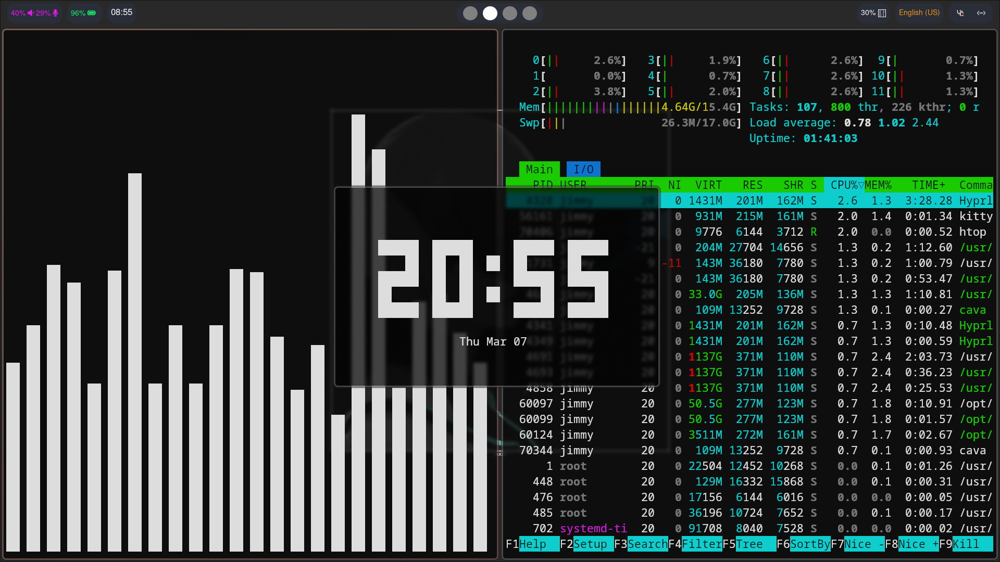
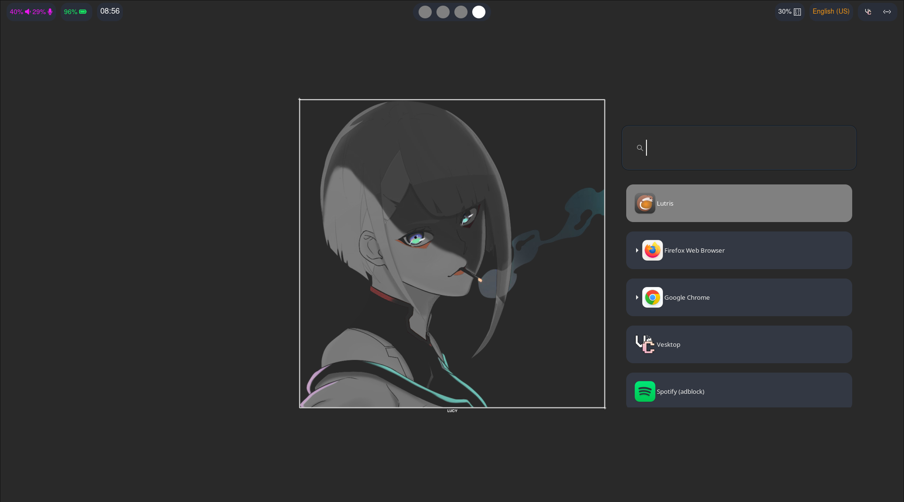

# hypr-Jimmy my hyprland config


## Screenshots




## Automatic Installation

currently available on:  

- fedora
- fedora based distros
- Arch linux with yay installed
- Arch based distros with yay installed
- Debian
- Ubuntu
- Ubuntu based distros

for automatic installation I have provided an install script ` install.sh `.  
you can download and install automatically by running this command:  

```

git clone https://github.com/JimmyJohnes/hypr-jimmy/tree/main; cd hypr-jimmy; ./install.sh

```

## Manual Installation

for manual installation make sure you have these dependecies installed

### dependecies


- [hyprland](https://github.com/hyprwm/Hyprland)
- [wofi](https://hg.sr.ht/~scoopta/wofi)
- [swaync](https://github.com/ErikReider/SwayNotificationCenter)
- [waybar](https://github.com/Alexays/Waybar)
- [wlogout](https://github.com/ArtsyMacaw/wlogout)
- [swaylock](https://github.com/swaywm/swaylock)
- [swaybg](https://github.com/swaywm/swaybg)
- [kitty](https://github.com/kovidgoyal/kitty)
- [thunar file manager](https://docs.xfce.org/xfce/thunar/start)
- [brightnessctl](https://github.com/Hummer12007/brightnessctl)
- [pamixer](https://github.com/cdemoulins/pamixer)
- [kde-polkit] (https://github.com/KDE/polkit-kde-agent-1)

### moving config files

After that move each of the following files in their respective locations:  

hypr -> ~/.config/hypr  
swaync -> ~/.config/swaync  
waybar -> ~/.config/waybar  
wlogout -> ~/.config/wlogout  
kitty -> ~/.config/kitty  
swaylock -> ~/.swaylock  
wallpapers -> ~/.wallpapers  


## Uninstallation / Removal

### Automatic Uninstallation

Auto removal script is now available! just run this command

```

./uninstall.sh

```


### Manual Uninstallation

Delete all the dependecies downloaded in the installation and delete all directories moved in the config files part
